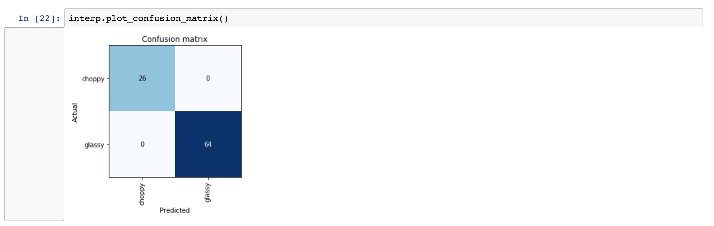

# glassy

Machine learning to predict glassy and choppy surf conditions

## More Info

So, as mentioned above, this is a model that predicts glassy (smooth, clean, etc) and choppy (bumpy, etc) surf conditions.




From these results, the model is probably overfit (the error rate is zero; which is too good to be true) but... still pretty cool. As I collect more data, I'll update the model (until I'm bored and move onto the next project).

# Setup

General requirements are:

- ffmpeg
- pipenv
- python3

Then:

```sh
$ pipenv install
$ pipenv shell
```

Or Docker...

# Local

Testing can be done with these photos or others:

- glassy: https://i.ibb.co/xG78GSc/1574353614-5842041f4e65fad6a7708966-0019.jpg
- choppy: https://i.ibb.co/f2MFGcQ/1574746546-20191125-T201826428-18.jpg

For instance, running a GET request for `http://localhost:8000/classify-url?url=https://i.ibb.co/xG78GSc/1574353614-5842041f4e65fad6a7708966-0019.jpg`.

To run the server:

```sh
$ uvicorn web:app
```

Or Docker...

# Deployment

Deployed to Heroku with Docker.
